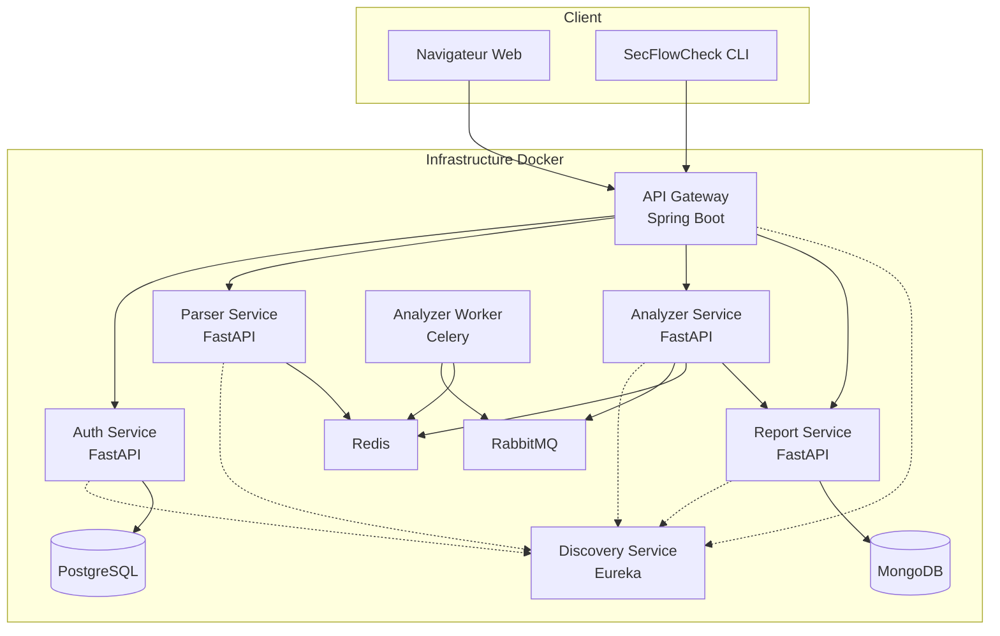

# SecFlowCheck

SecFlowCheck est une plateforme complète d'analyse de sécurité pour les pipelines CI/CD. Utilisant une architecture microservices moderne, elle combine l'intelligence artificielle et l'analyse statique pour détecter les vulnérabilités, les mauvaises configurations et les fuites de secrets dans vos workflows (GitHub Actions, GitLab CI, etc.).

## � Sommaire
1.  [Architecture](#-architecture)
2.  [Prérequis](#-prérequis)
3.  [Installation et Démarrage](#-installation-et-démarrage)
4.  [Accès aux Services](#-accès-aux-services)
5.  [Fonctionnalités Clés](#-fonctionnalités-clés)
6.  [CLI](#-cli-interface-en-ligne-de-commande)
7.  [Démonstration Vidéo](#-démonstration-vidéo)
8.  [Contribution](#-contribution)

## �🚀 Architecture

Le projet repose sur une architecture microservices distribuée, orchestrée par Docker Compose.



###  Frontend

###  Frontend
- **Frontend V2** (`secflowcheck-frontend-v2`) : Application web moderne construite avec **Next.js**, **React** et **Tailwind CSS**. Elle offre une interface utilisateur intuitive pour soumettre des fichiers de pipeline, visualiser les rapports d'analyse et gérer les utilisateurs.

### Backend & Microservices
L'accès aux services backend est centralisé via une API Gateway.

1.  **API Gateway** (`secflowcheck-gateway`) : Basée sur **Spring Cloud Gateway**. Elle gère le routage, la sécurité (CORS) et l'équilibrage de charge vers les différents microservices.
2.  **Service Discovery** (`secflowcheck-discovery`) : Serveur **Netflix Eureka** permettant l'enregistrement et la découverte dynamique des services.
3.  **Authentication Service** (`secflowcheck-authentication`) : Service **FastAPI** gérant l'inscription, la connexion (JWT), et l'authentification OAuth2 (Google, GitHub, GitLab). Utilise **PostgreSQL** pour le stockage des utilisateurs.
4.  **Parser Service** (`secflowcheck-parser`) : Service **FastAPI** chargé de lire et structurer les fichiers de configuration de pipeline (YAML, JSON) pour en extraire les informations pertinentes.
5.  **Analyzer Service** (`secflowcheck-analyzer`) : Le cœur "IA" du système. Service **FastAPI** intégrant un modèle de Machine Learning pour classifier et détecter les anomalies de sécurité. Il utilise **Celery** et **RabbitMQ** pour le traitement asynchrone des analyses lourdes.
    -   **Analyzer Worker** : Worker Celery dédié à l'exécution des tâches d'analyse en arrière-plan.
6.  **Report Service** (`secflowcheck-report`) : Service **FastAPI** responsable de la génération et du stockage des rapports d'audit. Il permet l'exportation en PDF et stocke les résultats dans **MongoDB**.

### Infrastructure & Données
-   **PostgreSQL** : Base de données relationnelle pour le service d'authentification.
-   **MongoDB** : Base de données NoSQL pour le stockage des rapports d'analyse.
-   **Redis** : Broker de messages et cache pour Celery et les sessions.
-   **RabbitMQ** : Message broker pour la communication asynchrone entre l'analyseur et le worker.
-   **pgAdmin** : Interface web pour la gestion de PostgreSQL.
-   **Mongo Express** : Interface web pour la gestion de MongoDB.

---

## 🛠 Prérequis

Avant de commencer, assurez-vous d'avoir installé :
-   [Docker](https://www.docker.com/products/docker-desktop) et Docker Compose.
-   [Git](https://git-scm.com/).

---

## 📦 Installation et Démarrage

1.  **Cloner le dépôt**
    ```bash
    git clone https://github.com/votre-utilisateur/SecFlowCheck.git
    cd SecFlowCheck
    ```

2.  **Configuration**
    Assurez-vous que le fichier `.env` à la racine est correctement configuré avec vos secrets (clés API, mots de passe DB, etc.).

3.  **Lancer l'application**
    La commande suivante construit les images Docker et démarre tous les services :
    ```bash
    docker-compose up -d --build
    ```
    *Cette opération peut prendre quelques minutes lors de la première exécution (téléchargement des images, installation des dépendances).*

4.  **Vérifier le statut**
    ```bash
    docker-compose ps
    ```
    Tous les conteneurs devraient être à l'état `Up` (ou `healthy`).

---

## 🌐 Accès aux Services

Une fois l'application démarrée, vous pouvez accéder aux différentes interfaces :

| Service | URL / Port | Description |
| :--- | :--- | :--- |
| **Application Web** | `http://localhost:3000` | Interface utilisateur principale |
| **API Gateway** | `http://localhost:8080` | Point d'entrée unique des APIs |
| **Service Discovery** | `http://localhost:8761` | Tableau de bord Eureka |
| **API Documentation** | Via Gateway | Accès aux Swagger des microservices via la Gateway |
| **pgAdmin** | `http://localhost:5050` | Gestion PostgreSQL |
| **Mongo Express** | `http://localhost:8081` | Gestion MongoDB |
| **RabbitMQ** | `http://localhost:15672` | Tableau de bord RabbitMQ (user/pass par défaut) |

---

## 🧪 Fonctionnalités Clés

-   **Analyse de Sécurité** : Détection automatique des failles dans les fichiers `.gitlab-ci.yml`, `.github/workflows/*.yml`.
-   **Rapports Détaillés** : Visualisation des vulnérabilités avec score de sécurité et recommandations.
-   **Export PDF** : Téléchargement des rapports pour archivage ou partage.
-   **Authentification Sécurisée** : Support des comptes locaux et des fournisseurs OAuth sociaux.
-   **Tableau de Bord** : Vue d'ensemble de l'historique des analyses.

---

## 📝 CLI (Interface en Ligne de Commande)

Le projet inclut également un CLI permettant d'intégrer SecFlowCheck directement dans vos terminaux ou scripts CI/CD.
*(Détails d'installation et d'utilisation du CLI à compléter selon l'implémentation spécifique).*

---

## 🎬 Démonstration Vidéo

Découvrez la présentation complète des fonctionnalités de SecFlowCheck (Durée : 3 min).

[![Regarder la vidéo de démo] https://drive.google.com/file/d/1OzSrPAD4I3fG5RAXR95navIbpO57zbki/view?usp=drive_link

## 🤝 Contribution

Les contributions sont les bienvenues !
1.  Forkez le projet.
2.  Créez votre branche de fonctionnalité (`git checkout -b feature/AmazingFeature`).
3.  Commitez vos changements (`git commit -m 'Add some AmazingFeature'`).
4.  Poussez vers la branche (`git push origin feature/AmazingFeature`).
5.  Ouvrez une Pull Request.
