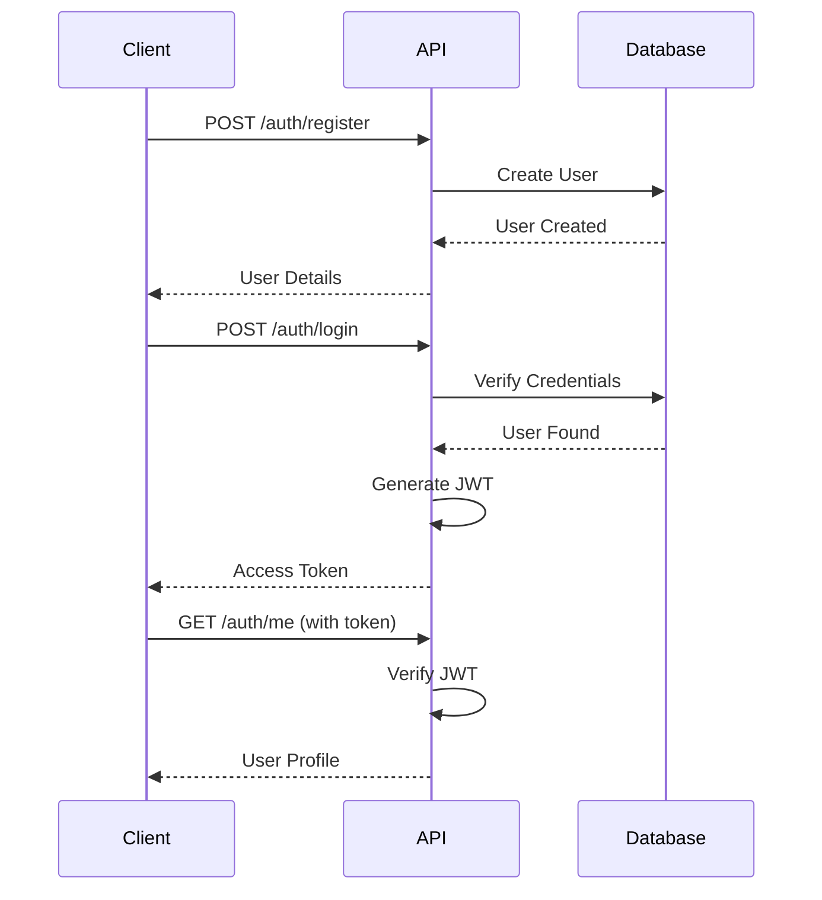
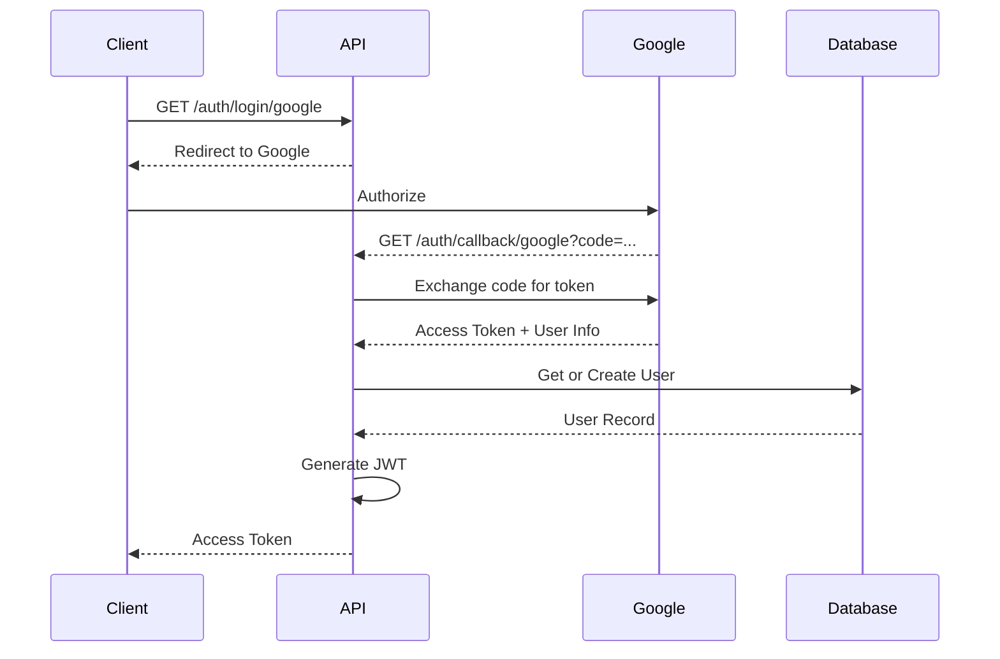

# SecFlowCheck Authentication Service

A FastAPI-based authentication and user management service that provides JWT-based authentication, social login integration (Google, GitHub, GitLab), and user management for the SecFlowCheck platform.

## Overview

The Authentication Service is responsible for:
- User registration and login (local and social providers)
- JWT token generation and validation
- Password hashing and verification
- OAuth2 integration (Google, GitHub, GitLab)
- User profile management
- PostgreSQL database for user storage
- Eureka service registration

## Features

- 🔐 **JWT Authentication**: Secure token-based authentication
- 🌐 **Social Login**: Google, GitHub, and GitLab OAuth integration
- 👤 **User Management**: Registration, login, profile updates
- 🔒 **Password Security**: Bcrypt hashing
- 🗄️ **PostgreSQL Storage**: Reliable user data persistence
- ⚡ **Async Operations**: High-performance async database queries
- 🌍 **Service Discovery**: Eureka integration

## Architecture

### Components

- **FastAPI Application**: REST API for authentication
- **SQLAlchemy ORM**: Database models and queries
- **Authlib**: OAuth2 client library
- **PostgreSQL**: User data storage
- **Eureka Client**: Service registration

## Installation

### Prerequisites

- Python 3.8+
- PostgreSQL 12+
- OAuth credentials (Google, GitHub, GitLab)
- Access to Eureka Discovery service

### Local Development

1. **Navigate to the service directory:**
   ```bash
   cd secflowcheck-authentication
   ```

2. **Create and activate virtual environment:**
   ```bash
   python -m venv .venv
   source .venv/bin/activate  # On Windows: .venv\Scripts\activate
   ```

3. **Install dependencies:**
   ```bash
   pip install -r requirements.txt
   ```

4. **Configure environment variables:**
   
   Create a `.env` file:
   ```env
   DEBUG=True
   APP_TITLE=SecFlowCheck Authentication Service
   APP_NAME=auth-service
   VERSION=1.0.0
   
   # Database
   POSTGRES_HOST=localhost
   POSTGRES_PORT=5432
   POSTGRES_USER=postgres
   POSTGRES_PASSWORD=yourpassword
   POSTGRES_DATABASE=secflowcheck_auth
   
   # JWT
   JWT_SECRET_KEY=your_super_secret_jwt_key_here
   JWT_ALGORITHM=HS256
   JWT_ACCESS_TOKEN_EXPIRE_MINUTES=30
   
   # Session
   SESSION_SECRET=your_session_secret_here
   
   # OAuth - Google
   GOOGLE_CLIENT_ID=your_google_client_id
   GOOGLE_CLIENT_SECRET=your_google_client_secret
   
   # OAuth - GitHub
   GITHUB_CLIENT_ID=your_github_client_id
   GITHUB_CLIENT_SECRET=your_github_client_secret
   
   # OAuth - GitLab
   GITLAB_CLIENT_ID=your_gitlab_client_id
   GITLAB_CLIENT_SECRET=your_gitlab_client_secret
   
   # Service Discovery
   EUREKA_SERVER=http://localhost:8761/eureka
   SERVICE_PORT=8005
   INSTANCE_IP=localhost
   ```

5. **Start PostgreSQL:**
   ```bash
   # Using Docker
   docker run -d -p 5432:5432 \
     -e POSTGRES_USER=postgres \
     -e POSTGRES_PASSWORD=yourpassword \
     -e POSTGRES_DB=secflowcheck_auth \
     --name postgres postgres:14
   ```

6. **Start the service:**
   ```bash
   uvicorn app.main:app --reload --port 8005
   ```

### Docker Deployment

```bash
docker build -t secflowcheck-authentication .
docker run -p 8005:8000 --env-file .env secflowcheck-authentication
```

## Configuration

### Environment Variables

| Variable | Description | Required |
|----------|-------------|----------|
| `POSTGRES_HOST` | PostgreSQL host | Yes |
| `POSTGRES_PORT` | PostgreSQL port | Yes |
| `POSTGRES_USER` | Database user | Yes |
| `POSTGRES_PASSWORD` | Database password | Yes |
| `POSTGRES_DATABASE` | Database name | Yes |
| `JWT_SECRET_KEY` | Secret key for JWT signing | Yes |
| `JWT_ALGORITHM` | JWT algorithm (HS256) | No |
| `JWT_ACCESS_TOKEN_EXPIRE_MINUTES` | Token expiration time | No |
| `SESSION_SECRET` | Session middleware secret | Yes |
| `GOOGLE_CLIENT_ID` | Google OAuth Client ID | No |
| `GOOGLE_CLIENT_SECRET` | Google OAuth Secret | No |
| `GITHUB_CLIENT_ID` | GitHub OAuth Client ID | No |
| `GITHUB_CLIENT_SECRET` | GitHub OAuth Secret | No |
| `GITLAB_CLIENT_ID` | GitLab OAuth Client ID | No |
| `GITLAB_CLIENT_SECRET` | GitLab OAuth Secret | No |

## API Endpoints

### POST `/auth/register`

Register a new user.

**Request Body:**
```json
{
  "email": "user@example.com",
  "password": "SecurePassword123!",
  "full_name": "John Doe"
}
```

**Response (201 Created):**
```json
{
  "id": 1,
  "email": "user@example.com",
  "full_name": "John Doe",
  "provider": "local",
  "created_at": "2025-12-22T19:30:00Z"
}
```

### POST `/auth/login`

Login with email and password.

**Request Body:**
```json
{
  "email": "user@example.com",
  "password": "SecurePassword123!"
}
```

**Response (200 OK):**
```json
{
  "access_token": "eyJhbGciOiJIUzI1NiIsInR5cCI6IkpXVCJ9...",
  "token_type": "bearer",
  "user": {
    "id": 1,
    "email": "user@example.com",
    "full_name": "John Doe"
  }
}
```

### GET `/auth/me`

Get current user information (requires authentication).

**Headers:**
```
Authorization: Bearer <access_token>
```

**Response (200 OK):**
```json
{
  "id": 1,
  "email": "user@example.com",
  "full_name": "John Doe",
  "provider": "local",
  "created_at": "2025-12-22T19:30:00Z"
}
```

### Social Login Endpoints

#### GET `/auth/login/google`
Redirect to Google OAuth login page.

#### GET `/auth/callback/google`
Google OAuth callback handler.

#### GET `/auth/login/github`
Redirect to GitHub OAuth login page.

#### GET `/auth/callback/github`
GitHub OAuth callback handler.

#### GET `/auth/login/gitlab`
Redirect to GitLab OAuth login page.

#### GET `/auth/callback/gitlab`
GitLab OAuth callback handler.

**Social Login Response:**
```json
{
  "access_token": "eyJhbGciOiJIUzI1NiIsInR5cCI6IkpXVCJ9...",
  "token_type": "bearer",
  "user": {
    "id": 2,
    "email": "user@gmail.com",
    "full_name": "Jane Doe",
    "provider": "google"
  }
}
```

### GET `/health`

Health check endpoint.

**Response:**
```json
{
  "status": "UP",
  "db": "PostgreSQL",
  "service": "auth-service"
}
```

## Authentication Flow

### Local Authentication



### OAuth Flow



## JWT Token Structure

```json
{
  "sub": "1",
  "email": "user@example.com",
  "exp": 1640187600,
  "iat": 1640184000
}
```

## Database Schema

### Users Table

```sql
CREATE TABLE users (
    id SERIAL PRIMARY KEY,
    email VARCHAR(255) UNIQUE NOT NULL,
    full_name VARCHAR(255),
    hashed_password VARCHAR(255),
    provider VARCHAR(50) DEFAULT 'local',
    provider_id VARCHAR(255),
    created_at TIMESTAMP DEFAULT CURRENT_TIMESTAMP,
    updated_at TIMESTAMP DEFAULT CURRENT_TIMESTAMP
);

CREATE INDEX idx_users_email ON users(email);
CREATE INDEX idx_users_provider ON users(provider, provider_id);
```

## OAuth Setup

### Google OAuth

1. Go to [Google Cloud Console](https://console.cloud.google.com/)
2. Create a new project or select existing
3. Enable Google+ API
4. Create OAuth 2.0 credentials
5. Add authorized redirect URI: `http://localhost:8005/auth/callback/google`
6. Copy Client ID and Client Secret to `.env`

### GitHub OAuth

1. Go to GitHub Settings → Developer settings → OAuth Apps
2. Register a new application
3. Set Authorization callback URL: `http://localhost:8005/auth/callback/github`
4. Copy Client ID and Client Secret to `.env`

### GitLab OAuth

1. Go to GitLab → User Settings → Applications
2. Create a new application
3. Set Redirect URI: `http://localhost:8005/auth/callback/gitlab`
4. Select `read_user` scope
5. Copy Application ID and Secret to `.env`

## Integration Examples

### Python Client

```python
import requests

BASE_URL = "http://localhost:8005"

# Register new user
response = requests.post(
    f"{BASE_URL}/auth/register",
    json={
        "email": "test@example.com",
        "password": "SecurePass123!",
        "full_name": "Test User"
    }
)
print(response.json())

# Login
response = requests.post(
    f"{BASE_URL}/auth/login",
    json={
        "email": "test@example.com",
        "password": "SecurePass123!"
    }
)
token = response.json()["access_token"]

# Get current user
headers = {"Authorization": f"Bearer {token}"}
response = requests.get(f"{BASE_URL}/auth/me", headers=headers)
print(response.json())
```

### JavaScript Client

```javascript
const BASE_URL = 'http://localhost:8005';

// Login
const response = await fetch(`${BASE_URL}/auth/login`, {
  method: 'POST',
  headers: { 'Content-Type': 'application/json' },
  body: JSON.stringify({
    email: 'user@example.com',
    password: 'SecurePass123!'
  })
});

const { access_token } = await response.json();

// Get user profile
const profile = await fetch(`${BASE_URL}/auth/me`, {
  headers: { 'Authorization': `Bearer ${access_token}` }
});

console.log(await profile.json());
```

## Security Best Practices

1. **Strong JWT Secrets**: Use cryptographically secure random keys
2. **HTTPS Only**: Always use HTTPS in production
3. **Token Expiration**: Set appropriate token lifetimes
4. **Password Policy**: Enforce strong password requirements
5. **Rate Limiting**: Implement rate limiting for login attempts
6. **CORS Configuration**: Restrict allowed origins
7. **Environment Variables**: Never commit secrets to version control

## Troubleshooting

### Cannot connect to PostgreSQL
- Verify PostgreSQL is running
- Check connection credentials in `.env`
- Ensure database exists
- Check firewall/network settings

### OAuth errors
- Verify OAuth credentials are correct
- Check redirect URIs match exactly
- Ensure OAuth apps are enabled
- Review provider-specific requirements

### JWT validation fails
- Check `JWT_SECRET_KEY` matches across services
- Verify token hasn't expired
- Ensure `Authorization` header format is correct

### Database migration errors
- Check table creation permissions
- Review PostgreSQL logs
- Use Alembic for production migrations

## Monitoring

### Health Checks

```bash
curl http://localhost:8005/health
```

### Database Monitoring

```sql
-- Check user count
SELECT COUNT(*) FROM users;

-- Provider distribution
SELECT provider, COUNT(*) 
FROM users 
GROUP BY provider;

-- Recent registrations
SELECT * FROM users 
ORDER BY created_at DESC 
LIMIT 10;
```

## Development

### Project Structure

```
secflowcheck-authentication/
├── app/
│   ├── main.py              # FastAPI application
│   ├── config.py            # Configuration
│   ├── database.py          # Database connection
│   ├── models/
│   │   └── user.py          # User model
│   ├── routes/
│   │   └── auth_routes.py   # Authentication endpoints
│   ├── services/
│   │   └── auth_service.py  # Business logic
│   ├── middleware/
│   └── extensions.py        # OAuth client setup
├── Dockerfile
├── requirements.txt
└── README.md
```

## License

Part of the SecFlowCheck project.
