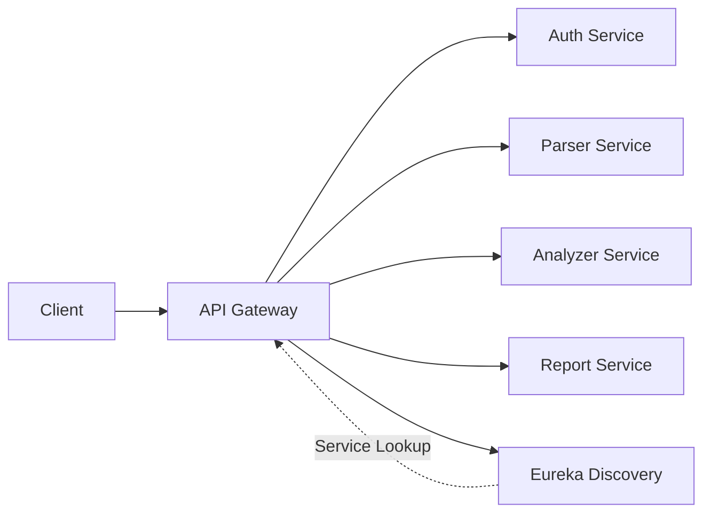

# SecFlowCheck API Gateway

A Spring Cloud Gateway service that provides unified API routing, load balancing, and authentication for the SecFlowCheck microservices architecture.

## Overview

The Gateway Service is responsible for:
- Routing requests to appropriate microservices
- Load balancing across service instances
- JWT token validation and authentication
- CORS configuration
- Service discovery integration (Eureka)
- Request/response filtering
- Centralized access control

## Features

- 🚀 **Intelligent Routing**: Dynamic routing via Spring Cloud Gateway
- 🔍 **Service Discovery**: Automatic service discovery via Eureka
- 🔐 **JWT Validation**: Centralized authentication
- ⚖️ **Load Balancing**: Client-side load balancing
- 🌐 **CORS Support**: Cross-origin resource sharing configuration
- 📊 **Request Logging**: Built-in logging filters
- ⚡ **High Performance**: Non-blocking reactive architecture

## Architecture

### Components

- **Spring Cloud Gateway**: Core routing engine
- **Eureka Client**: Service discovery integration
- **JWT Filter**: Token validation filter
- **Route Configuration**: YAML-based route definitions

### Routing Flow



## Installation

### Prerequisites

- Java 17+
- Maven 3.6+
- Access to Eureka Discovery service
- Running microservices

### Local Development

1. **Navigate to the service directory:**
   ```bash
   cd secflowcheck-gateway
   ```

2. **Configure application properties:**
   
   Edit `src/main/resources/application.yml`:
   ```yaml
   server:
     port: 8080

   spring:
     application:
       name: gateway-service
     cloud:
       gateway:
         discovery:
           locator:
             enabled: true
             lower-case-service-id: true
         routes:
           - id: auth-service
             uri: lb://auth-service
             predicates:
               - Path=/auth/**
           - id: parser-service
             uri: lb://parser-service
             predicates:
               - Path=/parser/**
           - id: analyzer-service
             uri: lb://analyzer-service
             predicates:
               - Path=/analyzer/**
           - id: report-service
             uri: lb://report-service
             predicates:
               - Path=/reports/**
             filters:
               - AuthenticationFilter

   eureka:
     client:
       service-url:
         defaultZone: http://localhost:8761/eureka/
     instance:
       prefer-ip-address: true
   ```

3. **Build the project:**
   ```bash
   mvn clean install
   ```

4. **Run the gateway:**
   ```bash
   mvn spring-boot:run
   ```

   Or run the JAR:
   ```bash
   java -jar target/secflowcheck-gateway-1.0.0.jar
   ```

### Docker Deployment

```bash
docker build -t secflowcheck-gateway .
docker run -p 8080:8080 secflowcheck-gateway
```

## Configuration

### Application Properties

| Property | Description | Default |
|----------|-------------|---------|
| `server.port` | Gateway port | `8080` |
| `spring.application.name` | Service name | `gateway-service` |
| `eureka.client.service-url.defaultZone` | Eureka server URL | `http://localhost:8761/eureka/` |
| `spring.cloud.gateway.discovery.locator.enabled` | Enable Eureka integration | `true` |

### Route Configuration

Routes are defined in `application.yml`:

```yaml
spring:
  cloud:
    gateway:
      routes:
        - id: service-name
          uri: lb://SERVICE-NAME  # Load balanced via Eureka
          predicates:
            - Path=/api/path/**
          filters:
            - StripPrefix=1
            - AuthenticationFilter
```

## Routes

### Authentication Service

```
POST   /auth/register    -> auth-service/auth/register
POST   /auth/login       -> auth-service/auth/login
GET    /auth/me          -> auth-service/auth/me (requires JWT)
GET    /auth/login/*     -> auth-service/auth/login/* (OAuth)
```

### Parser Service

```
POST   /parser/parse     -> parser-service/parse
GET    /parser/health    -> parser-service/health
```

### Analyzer Service

```
POST   /analyzer/analyze -> analyzer-service/analyze
GET    /analyzer/health  -> analyzer-service/health
```

### Report Service

```
POST   /reports          -> report-service/reports (requires API Key)
GET    /reports          -> report-service/reports (requires API Key)
GET    /reports/{id}     -> report-service/reports/{id} (requires API Key)
DELETE /reports/{id}     -> report-service/reports/{id} (requires API Key)
```

## Authentication

### JWT Authentication

Protected routes require JWT token in Authorization header:

```bash
curl -H "Authorization: Bearer <jwt_token>" \
  http://localhost:8080/auth/me
```

**Authentication Flow:**

1. Client sends request with JWT token
2. Gateway extracts token from `Authorization` header
3. Gateway validates JWT signature and expiration
4. If valid, request is forwarded to downstream service
5. If invalid, 401 Unauthorized is returned

### API Key Authentication

Some routes (like report service) use API key authentication:

```bash
curl -H "X-API-Key: <api_key>" \
  http://localhost:8080/reports
```

## CORS Configuration

CORS is configured to allow cross-origin requests:

```yaml
spring:
  cloud:
    gateway:
      globalcors:
        cors-configurations:
          '[/**]':
            allowed-origins:
              - "http://localhost:3000"
              - "http://localhost:8080"
            allowed-methods:
              - GET
              - POST
              - PUT
              - DELETE
              - OPTIONS
            allowed-headers:
              - "*"
            allow-credentials: true
```

## Filters

### Custom Filters

#### AuthenticationFilter

Validates JWT tokens for protected routes.

```java
@Component
public class AuthenticationFilter implements GatewayFilter {
    @Override
    public Mono<Void> filter(ServerWebExchange exchange, 
                            GatewayFilterChain chain) {
        String token = extractToken(exchange.getRequest());
        
        if (token == null || !isValid(token)) {
            exchange.getResponse().setStatusCode(HttpStatus.UNAUTHORIZED);
            return exchange.getResponse().setComplete();
        }
        
        return chain.filter(exchange);
    }
}
```

#### LoggingFilter

Logs incoming requests and outgoing responses.

```java
@Component
public class LoggingFilter implements GlobalFilter {
    @Override
    public Mono<Void> filter(ServerWebExchange exchange, 
                            GatewayFilterChain chain) {
        log.info("Request: {} {}", 
            exchange.getRequest().getMethod(),
            exchange.getRequest().getURI());
        
        return chain.filter(exchange);
    }
}
```

## Load Balancing

The gateway uses Ribbon for client-side load balancing:

```yaml
# Automatic load balancing via lb://
uri: lb://SERVICE-NAME
```

When multiple instances of a service are registered with Eureka, the gateway automatically distributes requests across them using round-robin by default.

## Usage Examples

### Via Gateway (Recommended)

```bash
# Register user
curl -X POST http://localhost:8080/auth/register \
  -H "Content-Type: application/json" \
  -d '{
    "email": "user@example.com",
    "password": "SecurePass123!",
    "full_name": "Test User"
  }'

# Login
curl -X POST http://localhost:8080/auth/login \
  -H "Content-Type: application/json" \
  -d '{
    "email": "user@example.com",
    "password": "SecurePass123!"
  }'

# Scan pipeline
curl -X POST http://localhost:8080/parser/parse \
  -H "Content-Type: application/json" \
  -d '{
    "content": "name: CI\non: push\njobs:\n  build:\n    runs-on: ubuntu-latest",
    "filename": "ci.yml"
  }'
```

### Direct Service Access (Development Only)

```bash
# Parser Service (port 8001)
curl http://localhost:8001/parse

# Analyzer Service (port 8003)
curl http://localhost:8003/analyze

# Report Service (port 8004)
curl http://localhost:8004/reports
```

## Service Discovery

The gateway automatically discovers services via Eureka:

1. Services register with Eureka on startup
2. Gateway queries Eureka for service locations
3. Routes resolve service instances dynamically
4. Load balancing distributes requests

**View registered services:**
```bash
curl http://localhost:8761/eureka/apps
```

## Monitoring

### Health Check

```bash
curl http://localhost:8080/actuator/health
```

### Gateway Routes

```bash
curl http://localhost:8080/actuator/gateway/routes
```

**Response:**
```json
[
  {
    "route_id": "auth-service",
    "uri": "lb://auth-service",
    "predicates": ["Path=/auth/**"],
    "filters": []
  }
]
```

### Metrics

Enable Spring Boot Actuator for metrics:

```yaml
management:
  endpoints:
    web:
      exposure:
        include: health,info,metrics,gateway
```

## Error Handling

### Common Error Responses

**404 Not Found:**
```json
{
  "timestamp": "2025-12-22T19:30:00Z",
  "path": "/unknown",
  "status": 404,
  "error": "Not Found",
  "message": "No matching route found"
}
```

**401 Unauthorized:**
```json
{
  "timestamp": "2025-12-22T19:30:00Z",
  "path": "/auth/me",
  "status": 401,
  "error": "Unauthorized",
  "message": "Invalid or missing JWT token"
}
```

**503 Service Unavailable:**
```json
{
  "timestamp": "2025-12-22T19:30:00Z",
  "path": "/analyzer/analyze",
  "status": 503,
  "error": "Service Unavailable",
  "message": "analyzer-service is not available"
}
```

## Troubleshooting

### Gateway won't start
- Verify Eureka server is running
- Check port 8080 is not in use
- Review application logs for errors
- Ensure Java 17+ is installed

### Routes not working
- Check service is registered with Eureka
- Verify route configuration in `application.yml`
- Test direct service access to isolate issues
- Review gateway logs for routing errors

### JWT validation fails
- Ensure JWT secret matches auth service
- Check token hasn't expired
- Verify `Authorization` header format: `Bearer <token>`
- Review JWT validation filter logs

### Service not found
- Verify service is registered with Eureka
- Check service name matches route configuration
- Ensure Eureka client is enabled in services
- Wait for Eureka cache to refresh (~30 seconds)

## Performance Tuning

### Connection Pool

```yaml
spring:
  cloud:
    gateway:
      httpclient:
        pool:
          max-connections: 1000
          max-idle-time: 30s
```

### Timeouts

```yaml
spring:
  cloud:
    gateway:
      httpclient:
        connect-timeout: 5000
        response-timeout: 10s
```

## Development

### Project Structure

```
secflowcheck-gateway/
├── src/
│   └── main/
│       ├── java/
│       │   └── com/secflowcheck/gateway/
│       │       ├── GatewayApplication.java
│       │       ├── config/
│       │       │   └── GatewayConfig.java
│       │       └── filters/
│       │           ├── AuthenticationFilter.java
│       │           └── LoggingFilter.java
│       └── resources/
│           └── application.yml
├── pom.xml
├── Dockerfile
└── README.md
```

### Adding New Routes

Edit `application.yml`:

```yaml
spring:
  cloud:
    gateway:
      routes:
        - id: new-service
          uri: lb://new-service
          predicates:
            - Path=/api/new/**
          filters:
            - StripPrefix=1
```

## License

Part of the SecFlowCheck project.
